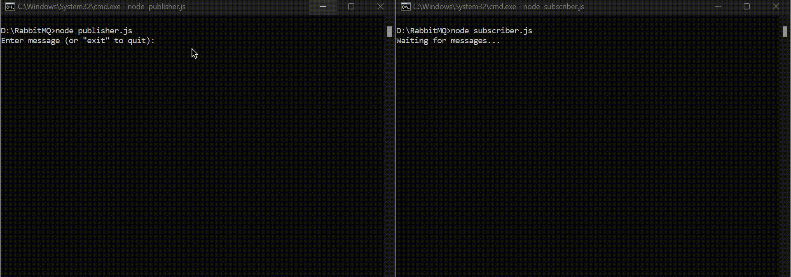
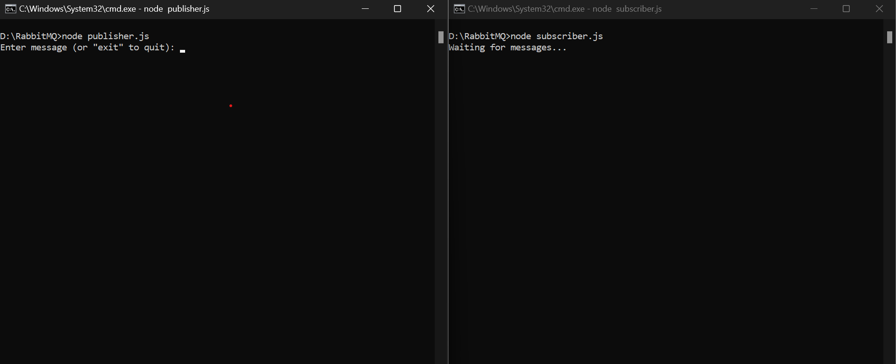
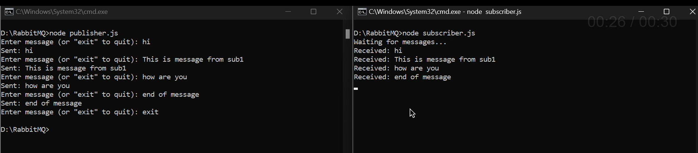

# Publisher-Subscriber Example with RabbitMQ and Node.js


This repository contains a simple example of a publisher-subscriber pattern implemented in Node.js using RabbitMQ.

## Introduction

This project demonstrates how to implement a publisher-subscriber pattern using RabbitMQ messaging broker in a Node.js environment. In this pattern, a publisher produces messages and sends them to a message queue, while one or more subscribers consume these messages from the queue asynchronously.

## Getting Started

To run this example, follow these steps:

1. **Install Docker:** Ensure that Docker is installed on your machine. You can download and install Docker from [https://www.docker.com/](https://www.docker.com/).

2. **Start RabbitMQ using Docker:** Open a terminal and run the following command to start RabbitMQ in a Docker container:

    ```bash
    docker run -it --rm --name rabbitmq -p 5672:5672 -p 15672:15672 rabbitmq:3.13-management
    ```

    This command will download and start a RabbitMQ container with management plugin enabled. Port 5672 is used for AMQP protocol, while port 15672 is used for accessing the RabbitMQ management UI.

3. **Run the Publisher:** Open another terminal window/tab, navigate to the project directory, and run the publisher script:

    ```bash
    node publisher.js
    ```

    This script will publish messages to the RabbitMQ message queue.

4. **Run the Subscriber:** Open another terminal window/tab, navigate to the project directory, and run the subscriber script:

    ```bash
    node subscriber.js
    ```

    This script will subscribe to the RabbitMQ message queue and consume messages as they are published.

## Screenshots and Recording

Below are screenshots and a recording demonstrating the publisher-subscriber pattern in action:

- 
- 
- 

## How It Works

In this example, the publisher script sends messages to a RabbitMQ queue named "task_queue", and the subscriber script listens for messages on the same queue. RabbitMQ acts as the message broker, facilitating communication between the publisher and subscriber.

## Example Applications

Beyond this basic example, RabbitMQ can be used in various applications, such as:

- Real-time chat applications (similar to WhatsApp)
- Task queues for distributing work among workers
- Event-driven microservices architecture

## Project Intention

The intention of this project is to demonstrate the simplicity and effectiveness of RabbitMQ for implementing asynchronous messaging patterns in Node.js applications. By understanding the publisher-subscriber pattern and its applications, developers can leverage RabbitMQ to build scalable and resilient systems.

## Contributing

Contributions are welcome! Feel free to open an issue or submit a pull request with any improvements or suggestions.